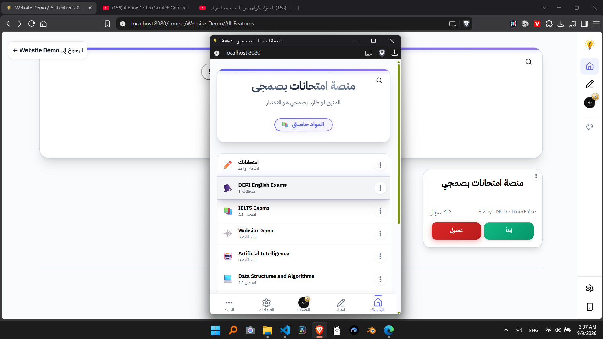
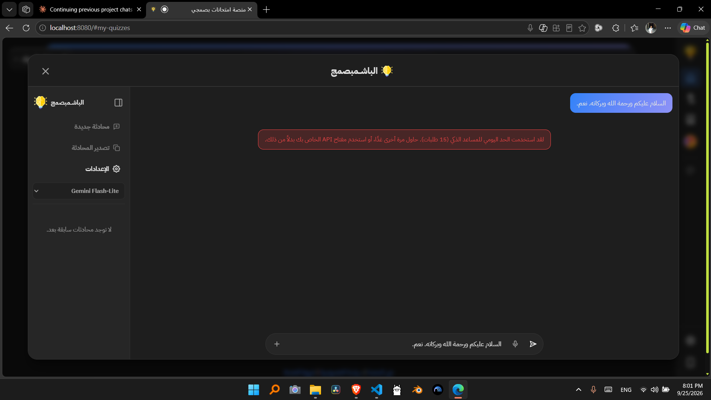

# Project Issues and Follow-up Work

## What is this file
`docs/issues.md` is were I draft my notes/ideas on updated that I'm currently doing, or things I found while testing the pages. These are mostly either fixes or new features ideas. These are drafts that changes constantly, not actual plans that are ready to be implemented. 

Issues in here have to be studies and tested well, then turned into a plan, before actually implementing it.

## Patches

### Courses & Folders OG Images
- Right Column of the info table aren't all on the same x access, some are slightly to the left, others to the right slightly.
- (On Folders OG Images) When the course name is Arabic (like "اللغة العربية"), it gets reversed (e.g., "العربية اللغة")

### امتحاناتك Rules
Check the rules for creating امتحانات and copying them and moving them.
**No 2 elements of the same type and the same name should exist at the same course/folder (or root امتحاناتك)**
- The `نسخ لامتحاناتي` button sometimes doesn't show the animations (on bigger courses, more than 40 quizzes), clicking it quits the menu immedietly, then after a while (takes longer than usual), the big course/folder gets copied. Between my press to the button the first time, and the course/folder being actually copied, I got confused, so I opened the menu again and pressed the `نسخ لامتحاناتي` button again, after the lag/loading time finished, the course/folder was copied many times.
- The `.create-quiz-inline-modal` has messed up styles on phones, no top padding
- Fix the `.copyAiPromptBtn` with its arrow, the arrow's animation is broken on "الأداء الفائق" mode (data-motion="reduced"), and the button is too wide.

### Dropdowns in امتحاناتك
- Pressing the more button on a quiz, the dropdown shows, then pressing another more button on anohter quiz, the first one closes, the second shows (Correct Behavior).
- Right cliking a quiz shows the right click menu, then pressing the more button, opens it on top of the right-click menu (Incorrect): Only one menu should be open.

### `.sidebar-brand-link`
But a transition on the `.sidebar-brand-link` for opening/closing side-menu on desktops, because the `.sidebar-brand-link` appears instantly while the side-menu on desktops has a transition.

### Google Sign in on localhost.
- Signing in doesn't work on localhost for somereason.  See [last solution attempt with AI](unsolved-localhost-sign-in-issue--maybe-related-to-AOth-console-config-or-DB-config.md)
- See 

### Create Quiz Page
- Items in the `.gmd-group-latex` and the dropdown of it aren't clear, use actual icons (spacially for `#gmdMatrix`), not text.
- ALT + N shortcut is broken. And both `#gmdSub` aren't visible.
- Reorder mode Shouldn't change the collapsed state of questions. Just like the select mode, it shouldn't touch the collapse satete of questions, it currently expands all of them.
- Performance: create-quiz.js is ~4,300 lines in one file — This is a good candidate to split into modules
- Accessibility:
  - Dropdown menus (.menu-dropdown, .gmd-dropdown-menu) don't appear to trap focus or support arrow-key navigation between items — worth adding roving tabindex + arrow key handling since they already have role="menu".
  - Verify color contrast on .gmd-btn-latex (uses --color-text-tertiary, often a lighter gray) against the toolbar background..
- Skeleton Loader for start page.
- `.question-more-btn` moves its location based the screen size. That shouldn't happen. It should always be on the top left of the question card
- There should be versions of the `.section-actions` buttons in the `.app-title-bar`, so users can do these actions without having to scroll all the way up to find them.
- There are 2 `x` button on the `#questionSearch`, keep the `#clearSearch` and remove the other.
- Default/Initial size of the ` الشرح (اختياري)` input should be small (one line), because it's currently too big initially. Same for the `نصّ السؤال *`, it should also be small initially (one line).
- The `.entry-item-thumb-new` should show immedietly on page load, since it'a a static element, doesn't need to load anything from the DB or localStorage. It should be in the HTML directly.
- On Phones, when clicking on a `.menu-trigger` in the `.app-title-bar`, its `.menu-dropdown` appears, but when I press on a second `.menu-trigger`, its menu doesn't appear, but the first menu closes. Meaning it takes 2 clicks for the second one, a click to close the first open menu dropdown, a second click to open the second menu dropdown.
- The `.entry-item-thumb-new` button should appear as soon as the page loads, it shouldn't load with other content that is being pulled from localstorage, it should load immedietly, put it in the HTML itself if it's not already in it.
- The `#appTitleText` doesn't get updated when the AI Agent creates/edits a quiz, the whole page gets updated, except for the title. Fix it.

### AI Agent On Phones.
- The side-menu has wrong direction on some elements on phones, like the side-menu open button is on the left, even though the menu opens from the right
- The `.ai-agent-sidebar-header` should have the close button on the right, too, and the logo on the left.  
- `محادثة جديدة` button should be disabled when it's already a new chat.

### Document Pages
Fix the `public\src\features\privacy-and-terms\documentation-shell.js`, because the side-menu on phones in document pages doesn't match the rest of the platform. It doesn't have the sign-in button, reports button, and change username button, instead it has a useless create-quiz.html link button, create-quiz.html is in the bottom nav, remove it from the side-menu on phones and add the other 3 buttons

## New Features

### Admin actions and deletion flow (New Features)
See [Implementation Plan](<plans/Admin actions and deletion flow for quizzes.md>)

### Search and navigation refinements (Home Page)
- The footer may sit too high and does not always remain pinned to the bottom of the page when the content area is short.
- The home page search icon and input placement need refinement.
- The search button should be aligned at the lower-right rather than upper-right.
- The search bar should appear within the header itself.
- When the search bar is visible, the header search button should be hidden to avoid duplication. And try to align the search input's search icon in place of the header search button.
- The search icon disappears when I enter a course that only has subfolders in its first level, this issue is probably due to the folders & courses not being actual objects in the DB, we may choose to solve this issue after we migrate the whole platform to be DB quizzes only, and give up on relative-path quizzes uploaded with the code.

### Markdown engine enhancement
- Update the markdown engine to behave more like GitHub markdown rendering, with embeded media like vidoes, audio, and images.
- It should be implemented after implementing media inside the quiz body in the `quiz.html` page.
  - Because for some reason, the quiz page rerenders each time the user interacts with the quiz (presses a button), which reloads every videos, images, and audio. that's why media is currently out of the quiz body. We should fix that issue first, before migrating the media to be rendered through the markdown engine.
  - The `export-to-quiz.js` feature renders media inside the question body, and doesn't rerender the question after each interaction, so you can learn from it.
- After implementing this feature, migrate all quizzes to embed the media in the question body itself, and delete all legacy code related to the object media rendering, because now media will be in the question body itself.
- This will allow quiz creators to add multiple pieces of media to each question or add media to options, explanations, and formal answers.
- Now all quizzes created from the home page (index.html), create-quiz.html, or through the AI Agent, should use YouTube, images, audio, and vidoes using this way only. Users shouldn't be able to create Legacy YouTube, audio, images, and videos objects. 

### Quizzes Improvement (Suggestions)
- Number of Views or people who solved a quiz on each quiz.
- Detailed info: Instead of listing the questions types and question number (["Essay", "MCQ", "True/False"] [30]) we should count the number of each individual type, so we now the number of essays, the number of MCQs, and the number of True/False.
- Connect Password typing memory on the main page to the quiz page, so if the user had to type the password on the main page to download it, they don't have to type it again for the same quiz on the quiz.html page on the same visit.
- Allow users to switch view on the home page, when there is not a compulsory view.
- Advanced Loading skeletong on the quiz.html page that works also when the `الاداء الفائق` mode is on.

### Meme videos on result pages (Easy to make, but very important)
- Add a result-page feature that displays themed meme videos based on the user’s degree or score.
- Suggested themes include:
  - دعوية
  - إسلامية
  - قرآن
  - ميمز تشجيع سلبية
  - ميمز تشجيع إيجابية

### App SEO and GEO 
- Improve the SEO and GEO of the platform, take them to the next level, the objective is that whenever a new quiz, folder, or course get added to the platform, Google knows about it, just like when a new YouTube video dropds Google knows about it. AI and search engines should know about the whole platform.

### Settings Page
- The page shows false/placeholder values at start, which confuses some users. Implement a loading skeleton/state before displaying any info.
- The carrot on the dropdowns is too close to the left border, fix the padding/margin or whatever is wrong.

### Translation and content expansion (Suggestion)
- Add English translation support.

### Home Page

#### Loading
*Important Note: This update comes after converting the platform to have DB quizzes only. Before that, it depended on relative-path quizzes updated with the code, and a relative path manifest with logic to merge them with quizzes coming from the DB. Now the Platform depends on the DB only, with all legacy code deleted*

- امتحاناتك section should load independantly.
- Don't load the whole DB for the manifest, just the courses, then when the initial view loads (which is top view, which is courses only), start loading their subfolder in the background.
- When a course or folder is visited directly (e.g., `http://basmagi-quiz.vercel.app/course/Website-Demo/All-Features`) load only what is enough to show its elements, then when it loads, start loading everything else in the background. This would speed up loading time significantly.
- On localhost, sometimes the home page (index.html) takes too much time to load, the animation shimmer on the skeleton cards just keeps going, the cards never actually load, and I have to reload the whole page for it to work.

#### Improvements
- The side menu admin badge and favicon size should be improved visually.

#### Password
When there is a quiz with a password, and the user downloads the quiz, he has to enter the password once, and they can download the quiz many times, because it's remembered that they know that password. The objective is to connect that to the quiz page, so when the user enters the password to download the quiz, then takes it in the quiz page, he shouldn't be asked for it again. 