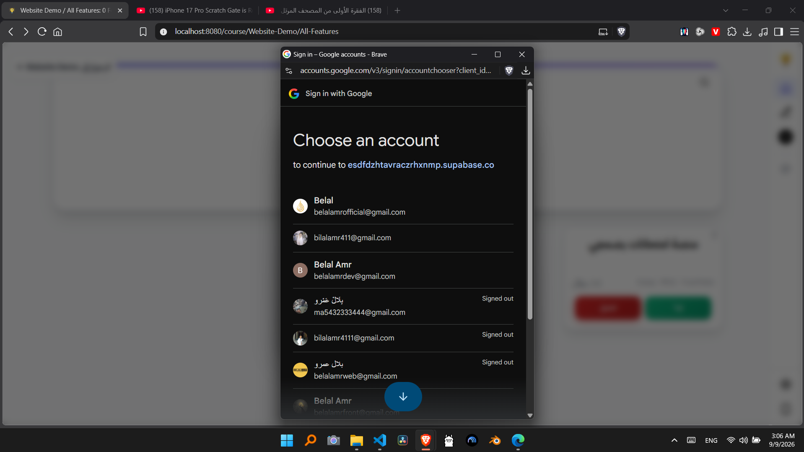

# Project Issues and Follow-up Work

## What is this file
`docs/issues.md` is were I draft my notes/ideas on updated that I'm currently doing, or things I found while testing the pages. These are mostly either fixes or new features ideas. These are drafts that changes constantly, not actual plans that are ready to be implemented. 

Issues in here have to be studies and tested well, then turned into a plan, before actually implementing it.

## Broken Elements

### Production is down
When users visit the index.html, it keeps loading, skeleton animation goes on and on, courses never appear.

Supabase Logs: 
## Log 1
**Timestamp:** 2026-09-09T00:54:21.083Z
**Message:** OPTIONS | 200 | https://esdfdzhtavraczrhxnmp.supabase.co/auth/v1/token?grant_type=refresh_token | Mozilla/5.0 (Windows NT 10.0; Win64; x64) AppleWebKit/537.36 (KHTML, like Gecko) Chrome/152.0.0.0 Safari/537.36

**Details:**
```json
{
  "date": "2026-09-09T03:54:21.083Z",
  "method": "OPTIONS",
  "pathname": "/auth/v1/token",
  "status": "200",
  "level": "success",
  "log_type": "edge",
  "log_count": null,
  "logs": [],
  "auth_user": null
}
```

---

## Log 2
**Timestamp:** 2026-09-09T00:53:43.715Z
**Message:** OPTIONS | 200 | https://esdfdzhtavraczrhxnmp.supabase.co/auth/v1/token?grant_type=refresh_token | Mozilla/5.0 (Windows NT 10.0; Win64; x64) AppleWebKit/537.36 (KHTML, like Gecko) Chrome/152.0.0.0 Safari/537.36

**Details:**
```json
{
  "date": "2026-09-09T03:53:43.715Z",
  "method": "OPTIONS",
  "pathname": "/auth/v1/token",
  "status": "200",
  "level": "success",
  "log_type": "edge",
  "log_count": null,
  "logs": [],
  "auth_user": null
}
```

Vercel Logs:
```
-------------------------------------------
Copied 2 logs from Vercel Dashboard
- Project: quiz (prj_AkbjorAKui19S0kvntYi8R8YpsIh)
- Team: belalamrmohameds-projects (team_2cBpR4HzSJJlBxGhQBMazGHG)
- Search query: (no search query applied)
- Search timestamps: 2026-09-09T03:26:00.000Z to 2026-09-09T03:56:00.000Z
- Dashboard URL: https://vercel.com/belalamrmohameds-projects/quiz/logs
- Format: JSONL
- Documentation: https://vercel.com/docs/logs/runtime
-------------------------------------------

{"requestId":"plbr4-1788925996939-4b219922c801","timestamp":1788925996939,"deploymentId":"dpl_9euhQfUxeGVDz64MUTvDegqFVoBC","projectId":"prj_AkbjorAKui19S0kvntYi8R8YpsIh","level":"error","message":"[render-course] Supabase course lookup error: <!DOCTYPE html>\n<!--[if lt IE 7]> <html class=\"no-js ie6 oldie\" lang=\"en-US\"> <![endif]-->\n<!--[if IE 7]>    <html class=\"no-js ie7 oldie\" lang=\"en-US\"> <![endif]-->\n<!--[if IE 8]>    <html class=\"no-js ie8 oldie\" lang=\"en-US\"> <![endif]-->\n<!--[if gt IE 8]><!--> <html class=\"no-js\" lang=\"en-US\"> <!--<![endif]-->\n<head>\n\n<title>supabase.co | 522: Connection timed out</title>\n<meta charset=\"UTF-8\" />\n<meta http-equiv=\"Content-Type\" content=\"text/html; charset=UTF-8\" />\n<meta http-equiv=\"X-UA-Compatible\" content=\"IE=Edge\" />\n<meta name=\"robots\" content=\"noindex, nofollow\" />\n<meta name=\"viewport\" content=\"width=device-width,initial-scale=1\" />\n<link rel=\"stylesheet\" id=\"cf_styles-css\" href=\"/cdn-cgi/styles/main.css\" />\n</head>\n<body>\n<div id=\"cf-wrapper\">\n    <div id=\"cf-error-details\" class=\"p-0\">\n        <header class=\"mx-auto pt-10 lg:pt-6 lg:px-8 w-240 lg:w-full mb-8\">\n            <h1 class=\"inline-block sm:block sm:mb-2 font-light text-60 lg:text-4xl text-black-dark leading-tight mr-2\">\n                <span class=\"inline-block\">Connection timed out</span>\n                <span class=\"code-label\">Error code 522</span>\n            </h1>\n            <div>\n                Visit <a href=\"https://www.cloudflare.com/5xx-error-landing?utm_source=errorcode_522&utm_campaign=esdfdzhtavraczrhxnmp.supabase.co\" target=\"_blank\" rel=\"noopener noreferrer\">cloudflare.com</a> for more information.\n            </div>\n            <div class=\"mt-3\">2026-09-09 03:54:47 UTC</div>\n        </header>\n        <div class=\"my-8 bg-gradient-gray\">\n            <div class=\"w-240 lg:w-full mx-auto\">\n                <div class=\"clearfix md:px-8\">\n                    <div id=\"cf-browser-status\" class=\" relative w-1/3 md:w-full py-15 md:p-0 md:py-8 md:text-left md:border-solid md:border-0 md:border-b md:border-gray-400 overflow-hidden float-left md:float-none text-center\">\n  <div class=\"relative mb-10 md:m-0\">\n    \n    <span class=\"cf-icon-browser block md:hidden h-20 bg-center bg-no-repeat\"></span>\n    <span class=\"cf-icon-ok w-12 h-12 absolute left-1/2 md:left-auto md:right-0 md:top-0 -ml-6 -bottom-4\"></span>\n    \n  </div>\n  <span class=\"md:block w-full truncate\">You</span>\n  <h3 class=\"md:inline-block mt-3 md:mt-0 text-2xl text-gray-600 font-light leading-1.3\">\n  \n    Browser\n  \n  </h3>\n  \n  <span class=\"leading-1.3 text-2xl text-green-success\">Working</span>\n  \n</div>\n                    <div id=\"cf-cloudflare-status\" class=\" relative w-1/3 md:w-full py-15 md:p-0 md:py-8 md:text-left md:border-solid md:border-0 md:border-b md:border-gray-400 overflow-hidden float-left md:float-none text-center\">\n  <div class=\"relative mb-10 md:m-0\">\n    <a href=\"https://www.cloudflare.com/5xx-error-landing?utm_source=errorcode_522&#38;utm_campaign=esdfdzhtavraczrhxnmp.supabase.co\" target=\"_blank\" rel=\"noopener noreferrer\">\n    <span class=\"cf-icon-cloud block md:hidden h-20 bg-center bg-no-repeat\"></span>\n    <span class=\"cf-icon-ok w-12 h-12 absolute left-1/2 md:left-auto md:right-0 md:top-0 -ml-6 -bottom-4\"></span>\n    </a>\n  </div>\n  <span class=\"md:block w-full truncate\">Ashburn</span>\n  <h3 class=\"md:inline-block mt-3 md:mt-0 text-2xl text-gray-600 font-light leading-1.3\">\n  <a href=\"https://www.cloudflare.com/5xx-error-landing?utm_source=errorcode_522&utm_campaign=esdfdzhtavraczrhxnmp.supabase.co\" target=\"_blank\" rel=\"noopener noreferrer\">\n    Cloudflare\n  </a>\n  </h3>\n  \n  <span class=\"leading-1.3 text-2xl text-green-success\">Working</span>\n  \n</div>\n                    <div id=\"cf-host-status\" class=\"cf-error-source relative w-1/3 md:w-full py-15 md:p-0 md:py-8 md:text-left md:border-solid md:border-0 md:border-b md:border-gray-400 overflow-hidden float-left md:float-none text-center\">\n  <div class=\"relative mb-10 md:m-0\">\n    \n    <span class=\"cf-icon-server block md:hidden h-20 bg-center bg-no-repeat\"></span>\n    <span class=\"cf-icon-error w-12 h-12 absolute left-1/2 md:left-auto md:right-0 md:top-0 -ml-6 -bottom-4\"></span>\n    \n  </div>\n  <span class=\"md:block w-full truncate\">esdfdzhtavraczrhxnmp.supabase.co</span>\n  <h3 class=\"md:inline-block mt-3 md:mt-0 text-2xl text-gray-600 font-light leading-1.3\">\n  \n    Host\n  \n  </h3>\n  \n  <span class=\"leading-1.3 text-2xl text-red-error\">Error</span>\n  \n</div>\n                </div>\n            </div>\n        </div>\n\n        <div class=\"w-240 lg:w-full mx-auto mb-8 lg:px-8\">\n            <div class=\"clearfix\">\n                <div class=\"w-1/2 md:w-full float-left pr-6 md:pb-10 md:pr-0 leading-relaxed\">\n                    <h2 class=\"text-3xl font-normal leading-1.3 mb-4\">What happened?</h2>\n                    <p>The initial connection between Cloudflare's network and the origin web server timed out. As a result, the web page can not be displayed.</p>\n                </div>\n                <div class=\"w-1/2 md:w-full float-left leading-relaxed\">\n                    <h2 class=\"text-3xl font-normal leading-1.3 mb-4\">What can I do?</h2>\n                    \n                <h3 class=\"text-15 font-semibold mb-2\">If you're a visitor of this website:</h3>\n                <p class=\"mb-6\">Please try again in a few minutes.</p>\n\n                <h3 class=\"text-15 font-semibold mb-2\">If you're the owner of this website:</h3>\n                <p><span>Contact your hosting provider letting them know your web server is not completing requests. An Error 522 means that the request was able to connect to your web server, but that the request didn't finish. The most likely cause is that something on your server is hogging resources.</span> <a rel=\"noopener noreferrer\" href=\"https://developers.cloudflare.com/support/troubleshooting/http-status-codes/cloudflare-5xx-errors/error-522/\">Additional troubleshooting information here.</a></p>\n                </div>\n            </div>\n        </div>\n\n        <div class=\"cf-error-footer cf-wrapper w-240 lg:w-full py-10 sm:py-4 sm:px-8 mx-auto text-center sm:text-left border-solid border-0 border-t border-gray-300\">\n    <p class=\"text-13\">\n      <span class=\"cf-footer-item sm:block sm:mb-1\">Cloudflare Ray ID: <strong class=\"font-semibold\">a3833eb98a4cf331</strong></span>\n      <span class=\"cf-footer-separator sm:hidden\">&bull;</span>\n      <span id=\"cf-footer-item-ip\" class=\"cf-footer-item hidden sm:block sm:mb-1\">\n        Your IP:\n        <button type=\"button\" id=\"cf-footer-ip-reveal\" class=\"cf-footer-ip-reveal-btn\">Click to reveal</button>\n        <span class=\"hidden\" id=\"cf-footer-ip\">54.237.235.61</span>\n        <span class=\"cf-footer-separator sm:hidden\">&bull;</span>\n      </span>\n      <span class=\"cf-footer-item sm:block sm:mb-1\"><span>Performance &amp; security by</span> <a rel=\"noopener noreferrer\" href=\"https://www.cloudflare.com/5xx-error-landing?utm_source=errorcode_522&#38;utm_campaign=esdfdzhtavraczrhxnmp.supabase.co\" id=\"brand_link\" target=\"_blank\">Cloudflare</a></span>\n      \n    </p>\n    <script>(function(){function d(){var b=a.getElementById(\"cf-footer-item-ip\"),c=a.getElementById(\"cf-footer-ip-reveal\");b&&\"classList\"in b&&(b.classList.remove(\"hidden\"),c.addEventListener(\"click\",function(){c.classList.add(\"hidden\");a.getElementById(\"cf-footer-ip\").classList.remove(\"hidden\")}))}var a=document;document.addEventListener&&a.addEventListener(\"DOMContentLoaded\",d)})();</script>\n  </div><!-- /.error-footer -->\n\n    </div>\n</div>\n</body>\n</html>","source":"function","domain":"basmagi-quiz.vercel.app","requestMethod":"GET","requestPath":"/course/IELTS-Exams/Cambridge-IELTS-2020","responseStatusCode":200,"environment":"production","branch":"production","cache":"MISS"}
{"requestId":"dfvs8-1788925975040-0a210c4b8e4d","timestamp":1788925975040,"deploymentId":"dpl_9euhQfUxeGVDz64MUTvDegqFVoBC","projectId":"prj_AkbjorAKui19S0kvntYi8R8YpsIh","level":"error","message":"(node:4) [DEP0169] DeprecationWarning: `url.parse()` behavior is not standardized and prone to errors that have security implications. Use the WHATWG URL API instead. CVEs are not issued for `url.parse()` vulnerabilities.\n(Use `node --trace-deprecation ...` to show where the warning was created)","source":"function","domain":"basmagi-quiz.vercel.app","requestMethod":"GET","requestPath":"/course/IELTS-Exams/Cambridge-IELTS-2020","responseStatusCode":200,"environment":"production","branch":"production","cache":"MISS"}
```

### Courses & Folders OG Images
- Don't show the info: Last update on the og images made the Arabic labels (المادة ، السنة ، الترم) be RTL, it's that update where they stopped showing.

### Move-To Dialog Guide Overhaul
- The `.move-to-dialog-guide` system to tell the users the folder structure is not perfect, because `.move-to-dialog-rail` aren't connected toghether (they are visually different pieces).
- What I expected? Something similar to how YouTube structures its comment section nowadays (great, functional, expected, and elegant) .
  - Vertical lines & Horizontal lines that are **Connected together** to visualize the folder structure of the course or folder. 
- Expected Design:
  - A dialog guide that visualize the structure similar to a context map of a project: 

### User experience improvements in quiz creation
- The “إنشاء اختبار” `create-quiz-inline-modal` flow currently creates quizzes directly under the main “امتحاناتك” section directly instead of the folder or course that I'm currently sitting inside.
  - So if I'm standing in `/#my-quizzes/math/algebra` and I create a quiz through that modal, it gets created inside of `/#my-quizzes` directly, not in `/#my-quizzes/math/algebra` as intended.

### Sign in title on Google Sign in.
- When user sign in using Google, they don't see the name or the logo of the platform, they see a sequence of charachters that seem to be related to the Supabase DB something. 
- Signing in doesn't work on localhost for somereason.  See [last solution attempt with AI](unsolved-localhost-sign-in-issue--maybe-related-to-AOth-console-config-or-DB-config.md)

1. "Continue to esdfdzhtavraczrhxnmp.supabase.co" — this can't be fixed in code

Confirmed via Supabase's own docs/issue tracker: Google's OAuth consent screen always shows the domain of the OAuth callback URL, and with Supabase Auth that's always https://<project-ref>.supabase.co — there is no application-side setting that changes it. There are exactly two real fixes, both outside this codebase:

Google OAuth consent screen verification (free) — in Google Cloud Console → OAuth consent screen, set your app name/logo and go through Google's verification process. Once verified, Google shows your app name ("منصة امتحانات بصمجي") instead of the raw domain, even while the domain stays *.supabase.co underneath. Several teams in the Supabase community got this working for free this way.

### But a transition on the `.sidebar-brand-link` when opening/closing side-menu on desktops.


### AI Agnet Error 
- 
- 


Tested on localhost:
```
hook.js:1  POST http://localhost:8080/api/ai-agent/chat 502 (Bad Gateway)
apply @ hook.js:1
resendLastUserTurn @ ai-agent-chat.js:2231
resendLastUserTurn @ ai-agent-chat.js:2395
await in resendLastUserTurn
sendMessage @ ai-agent-chat.js:2455
(anonymous) @ ai-agent-chat.js:2472
ai-agent-chat.js:2257 [ai-agent-chat] /api/ai-agent/chat responded 502: {error: 'فشل الاتصال بمزوّد الذكاء الاصطناعي', detail: 'fetch failed'}detail: "fetch failed"error: "فشل الاتصال بمزوّد الذكاء الاصطناعي"[[Prototype]]: Object
resendLastUserTurn @ ai-agent-chat.js:2257
await in resendLastUserTurn
resendLastUserTurn @ ai-agent-chat.js:2395
await in resendLastUserTurn
sendMessage @ ai-agent-chat.js:2455
(anonymous) @ ai-agent-chat.js:2472
```

#### User Prompt
Makrdown rendering gets applied on the AI Agent Answer but not the user prompt. 

## New Features

### Search and navigation refinements (Home Page)
- The footer may sit too high and does not always remain pinned to the bottom of the page when the content area is short.
- The home page search icon and input placement need refinement.
- The search button should be aligned at the lower-right rather than upper-right.
- The search bar should appear within the header itself.
- When the search bar is visible, the header search button should be hidden to avoid duplication. And try to align the search input's search icon in place of the header search button.
- The search icon disappears when I enter a course that only has subfolders in its first level, this issue is probably due to the folders & courses not being actual objects in the DB, we may choose to solve this issue after we migrate the whole platform to be DB quizzes only, and give up on relative-path quizzes uploaded with the code.

### Admin actions and deletion flow (New Features)
- Admins should be able to delete folders and courses from the main quizzes area.
- Deletion should not be immediate; a trash or recovery workflow is needed.
- The trash can should support recovery, configurable retention time, emptying, and permanent deletion.
- Deleting a quiz must remove all associated media files as well.
- Similar consideration should be given to the “امتحاناتك” section.
- So new trash can for main quizzes (shared), and new trash can for users “امتحاناتك” section

### Meme videos on result pages (Easy to make, but very important)
- Add a result-page feature that displays themed meme videos based on the user’s degree or score.
- Suggested themes include:
  - دعوية
  - إسلامية
  - قرآن
  - ميمز تشجيع سلبية
  - ميمز تشجيع إيجابية

### Quiz creation page optimization
- Compress images client-side before uploading to the Supabase free tier.
- Convert images to highly compressed JPEG files without significant quality loss where possible.
- Compress audio files when practical.
- Google Docs like initial page with the options to 
  - Start creating a new quiz
  - edit last draft
  - edit a quiz from userquizzes

### Markdown engine enhancement
- Update the markdown engine to behave more like GitHub markdown rendering, with embeded media like vidoes, audio, and images.
- It should be implemented after implementing media inside the quiz body in the `quiz.html` page.
  - Because for some reason, the quiz page rerenders each time the user interacts with the quiz (presses a button), which reloads every videos, images, and audio. that's why media is currently out of the quiz body. We should fix that issue first, before migrating the media to be rendered through the markdown engine.
  - The `export-to-quiz.js` feature renders media inside the question body, and doesn't rerender the question after each interaction, so you can learn from it.
- After implementing this feature, migrate all quizzes to embed the media in the question body itself, and delete all legacy code related to the object media rendering, because now media will be in the question body itself.
- This will allow quiz creators to add multiple pieces of media to each question.

### User upload flow
- Allow normal users to upload quizzes as a new feature.

### Translation and content expansion (Suggestion)
- Add English translation support.

### Home Page Improvements
- The side menu admin badge and favicon size should be improved visually.

### Quizzes Improvement (Suggestions)
- Number of Views or people who solved a quiz on each quiz.
- Detailed info: Instead of listing the questions types and question number (["Essay", "MCQ", "True/False"] [30]) we should count the number of each individual type, so we now the number of essays, the number of MCQs, and the number of True/False.
- Connect Password typing memory on the main page to the quiz page, so if the user had to type the password on the main page to download it, they don't have to type it again for the same quiz on the quiz.html page on the same visit.
- Allow users to switch view on the home page, when there is not a compulsory view.

### Home Page Loading
*Important Note: This update comes after converting the platform to have DB quizzes only. Before that, it depended on relative-path quizzes updated with the code, and a relative path manifest with logic to merge them with quizzes coming from the DB. Now the Platform depends on the DB only, with all legacy code deleted*

- امتحاناتك section should load independantly.
- Don't load the whole DB for the manifest, just the courses, then when the initial view loads (which is top view, which is courses only), start loading their subfolder in the background.
- When a course or folder is visited directly (e.g., `http://basmagi-quiz.vercel.app/course/Website-Demo/All-Features`) load only what is enough to show its elements, then when it loads, start loading everything else in the background. This would speed up loading time significantly.
- On localhost, sometimes the home page (index.html) takes too much time to load, the animation shimmer on the skeleton cards just keeps going, the cards never actually load, and I have to reload the whole page for it to work.

### App SEO and GEO 
- List all unlisted pages (document pages, and reports page)