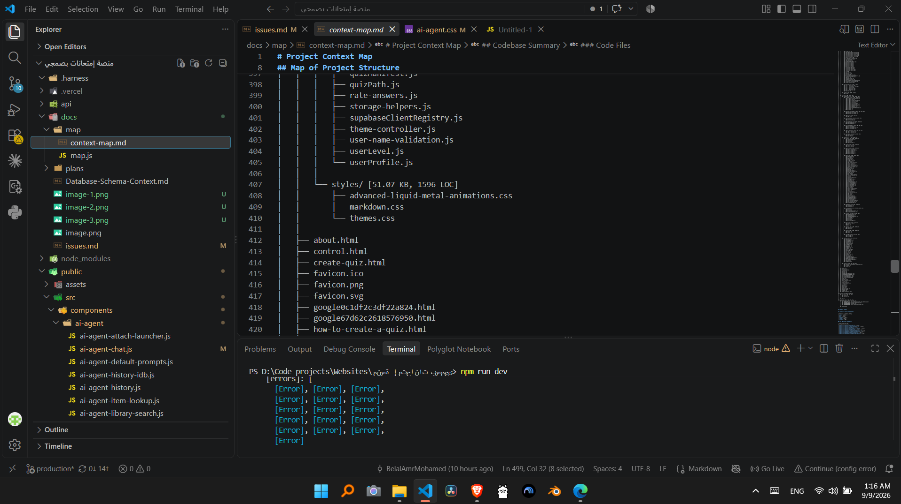
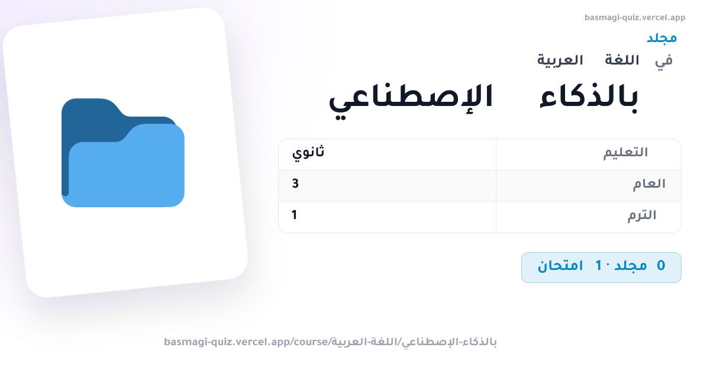
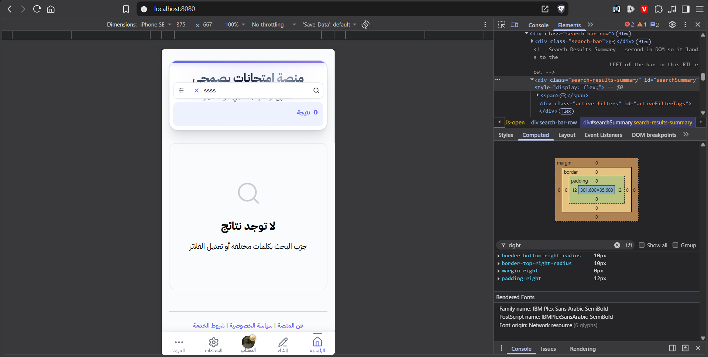

# Project Issues and Follow-up Work

## What is this file
`docs/issues.md` is were I draft my notes/ideas on updated that I'm currently doing, or things I found while testing the pages. These are mostly either fixes or new features ideas. These are drafts that changes constantly, not actual plans that are ready to be implemented. 

Issues in here have to be studies and tested well, then turned into a plan, before actually implementing it.

## Broken Elements

### Courses & Folders OG Images
- Right Column of the info table aren't all on the same x access, some are slightly to the left, others to the right slightly.
- (On Folders OG Images) When the course name is Arabic (like "اللغة العربية"), it gets reversed (e.g., "العربية اللغة")

### Move-To Dialog Guide Overhaul
- The `.move-to-dialog-guide` system to tell the users the folder structure is not perfect, because `.move-to-dialog-rail` aren't connected toghether (they are visually different pieces).
- Expected Design:
  - A dialog guide that visualize the structure similar to a context map of a project: 

### User experience improvements in quiz creation
- The “إنشاء اختبار” `create-quiz-inline-modal` flow currently creates quizzes directly under the main “امتحاناتك” section directly instead of the folder or course that I'm currently sitting inside.
  - So if I'm standing in `/#my-quizzes/math/algebra` and I create a quiz through that modal, it gets created inside of `/#my-quizzes` directly, not in `/#my-quizzes/math/algebra` as intended.

### `.exam-more-btn`
Clicking on the `.exam-more-btn` once opens it, clicking on it again, reopens it (closes then opens quickly). 
- Fix: Second press should close it.

### But a transition on the `.sidebar-brand-link` for opening/closing side-menu on desktops, because the `.sidebar-brand-link` appears instantly while the side-menu on desktops has a transition.

### Home Page Footer
The `.watermark` element on the home page climbs up very high when there is not enough content being displayed. The footer should stay at the bottom, it shouldn't move up when there is no content.

### Google Sign in on localhost.
- Signing in doesn't work on localhost for somereason.  See [last solution attempt with AI](unsolved-localhost-sign-in-issue--maybe-related-to-AOth-console-config-or-DB-config.md)

### AI Agnet Error 
- 
- 


Tested on localhost:
```
hook.js:1  POST http://localhost:8080/api/ai-agent/chat 502 (Bad Gateway)
apply @ hook.js:1
resendLastUserTurn @ ai-agent-chat.js:2231
resendLastUserTurn @ ai-agent-chat.js:2395
await in resendLastUserTurn
sendMessage @ ai-agent-chat.js:2455
(anonymous) @ ai-agent-chat.js:2472
ai-agent-chat.js:2257 [ai-agent-chat] /api/ai-agent/chat responded 502: {error: 'فشل الاتصال بمزوّد الذكاء الاصطناعي', detail: 'fetch failed'}detail: "fetch failed"error: "فشل الاتصال بمزوّد الذكاء الاصطناعي"[[Prototype]]: Object
resendLastUserTurn @ ai-agent-chat.js:2257
await in resendLastUserTurn
resendLastUserTurn @ ai-agent-chat.js:2395
await in resendLastUserTurn
sendMessage @ ai-agent-chat.js:2455
(anonymous) @ ai-agent-chat.js:2472
```

#### User Prompt
Makrdown rendering gets applied on the AI Agent Answer but not the user prompt. 

#### Creating Quizzes
- The AI Agent doesn't have the ability to set the place where the quiz gets put, it always get put inside `/#my-quizzes` directly. It should be able to set it's initial place (e.g., `/#my-quizzes/math/` or `/#my-quizzes/math/algebra/`).

#### Create-Quiz Page
Some of the elements of the AI Agent are broken on the create-quiz.html page, like the `.ai-agent-more-btn` and the `.ai-agent-history-item-more`

#### Result Page
The `.ai-agent-history-item-more` doesn't work on the result.html page.

#### Settings
Labels aren't connected to their inputs "No label associated with a form field"

#### Improvements
- The AI Agent Chat should use icons instead of emojis for pinned items.
- Remove the `لغة ردود المساعد` option from the settings, leave the choice of language to the AI, or the user can tell it in the prompt itself, remove that setting totally.
- Improve the UI/UX of the `.ai-agent-settings-actions` in the settings panel under the `مفتاح API الخاص بك (اختياري)`, so that both buttons are invisible when there is nothing saved (since there would be nothing to save or delete, the 2 buttons are useless), when the user is typing and nothing is saved, the save button only appears, when the value is saved the delete button only appears.

## New Features

### Search and navigation refinements (Home Page)
- The footer may sit too high and does not always remain pinned to the bottom of the page when the content area is short.
- The home page search icon and input placement need refinement.
- The search button should be aligned at the lower-right rather than upper-right.
- The search bar should appear within the header itself.
- When the search bar is visible, the header search button should be hidden to avoid duplication. And try to align the search input's search icon in place of the header search button.
- The search icon disappears when I enter a course that only has subfolders in its first level, this issue is probably due to the folders & courses not being actual objects in the DB, we may choose to solve this issue after we migrate the whole platform to be DB quizzes only, and give up on relative-path quizzes uploaded with the code.

### Admin actions and deletion flow (New Features)
- Admins should be able to delete folders and courses from the main quizzes area. Admin can currently delete quizzes.
- Deletion should not be immediate; a trash can or recovery workflow is needed for courses, folders and quizzes.
- Trash can or recovery workflow for the user-quizzes section `/@my-quizzes` first.
- The trash can should support recovery, configurable retention time, emptying, and permanent deletion.
- Deleting a quiz must remove all associated media files as well.
- Similar consideration should be given to the “امتحاناتك” section.
- So new trash can for main quizzes (shared), and new trash can for users “امتحاناتك” section.
- Admins should be able to Edit quizzes public quizzes, these needs a new button on quizzes, and create-quiz page update.
- Admins should be able to move folders and quizzes (similar to the امتحاناتك section)
- So, in the `.exam-more-btn` for quizzes, folders, and courses, a dropdown that will contain all admin actions will be added, it will include: 
  - The delete button (for sending quizzes, folders, or courses to the trash can, or some recovery workflow)
  - The move button (for moving quizzes or folders inside the course they are in). Uses similar Move-To Dialog Guide like that in the امتحاناتك section.
  - The edit button (for editing 'quizzes' in the create-quiz page).
  - The dropdown should be visible to admins only.

### Meme videos on result pages (Easy to make, but very important)
- Add a result-page feature that displays themed meme videos based on the user’s degree or score.
- Suggested themes include:
  - دعوية
  - إسلامية
  - قرآن
  - ميمز تشجيع سلبية
  - ميمز تشجيع إيجابية

### Markdown engine enhancement
- Update the markdown engine to behave more like GitHub markdown rendering, with embeded media like vidoes, audio, and images.
- It should be implemented after implementing media inside the quiz body in the `quiz.html` page.
  - Because for some reason, the quiz page rerenders each time the user interacts with the quiz (presses a button), which reloads every videos, images, and audio. that's why media is currently out of the quiz body. We should fix that issue first, before migrating the media to be rendered through the markdown engine.
  - The `export-to-quiz.js` feature renders media inside the question body, and doesn't rerender the question after each interaction, so you can learn from it.
- After implementing this feature, migrate all quizzes to embed the media in the question body itself, and delete all legacy code related to the object media rendering, because now media will be in the question body itself.
- This will allow quiz creators to add multiple pieces of media to each question.
- Now all quizzes created from the home page (index.html), create-quiz.html, or through the AI Agent, should use images, audio, and vidoes using this way only. Users shouldn't be able to create Legacy YouTube, audio, images, and videos. 

### User upload flow
- Allow normal users to upload quizzes as a new feature.

### Translation and content expansion (Suggestion)
- Add English translation support.

### Home Page Improvements
- The side menu admin badge and favicon size should be improved visually.

### Quizzes Improvement (Suggestions)
- Number of Views or people who solved a quiz on each quiz.
- Detailed info: Instead of listing the questions types and question number (["Essay", "MCQ", "True/False"] [30]) we should count the number of each individual type, so we now the number of essays, the number of MCQs, and the number of True/False.
- Connect Password typing memory on the main page to the quiz page, so if the user had to type the password on the main page to download it, they don't have to type it again for the same quiz on the quiz.html page on the same visit.
- Allow users to switch view on the home page, when there is not a compulsory view.

### Home Page Loading
*Important Note: This update comes after converting the platform to have DB quizzes only. Before that, it depended on relative-path quizzes updated with the code, and a relative path manifest with logic to merge them with quizzes coming from the DB. Now the Platform depends on the DB only, with all legacy code deleted*

- امتحاناتك section should load independantly.
- Don't load the whole DB for the manifest, just the courses, then when the initial view loads (which is top view, which is courses only), start loading their subfolder in the background.
- When a course or folder is visited directly (e.g., `http://basmagi-quiz.vercel.app/course/Website-Demo/All-Features`) load only what is enough to show its elements, then when it loads, start loading everything else in the background. This would speed up loading time significantly.
- On localhost, sometimes the home page (index.html) takes too much time to load, the animation shimmer on the skeleton cards just keeps going, the cards never actually load, and I have to reload the whole page for it to work.

### App SEO and GEO 
- Improve the SEO and GEO of the platform, take them to the next level, the objective is that whenever a new quiz, folder, or course get added to the platform, Google knows about it, just like when a new YouTube video dropds Google knows about it. AI and search engines should know about the whole platform. 

### Create Quiz Page
- Items in the `.gmd-group-latex` and the dropdown of it aren't clear, they are small, and sometimes look bad, redesign them, and use actual icons, not text.
- Add a "معاينة" button to the question's dropdown, to view that specific question rendered.
- Undo/redo feature for editing questions: Fix it, doesn't work on delete/duplicate/reorder.
- Reorder mode with a drag handle (there was a previous native-HTML5-DnD implementation and it was deliberately ripped out because it broke on touch), so this must be a (mode), not an always-on drag handle.
- Select Mode: For questions, to select multiple questions, delete/duplicate/reorder.
- Performance: create-quiz.js is ~4,300 lines in one file — This is a good candidate to split into modules
- Accessibility:
  - Dropdown menus (.menu-dropdown, .gmd-dropdown-menu) don't appear to trap focus or support arrow-key navigation between items — worth adding roving tabindex + arrow key handling since they already have role="menu".
  - Verify color contrast on .gmd-btn-latex (uses --color-text-tertiary, often a lighter gray) against the toolbar background.. 
