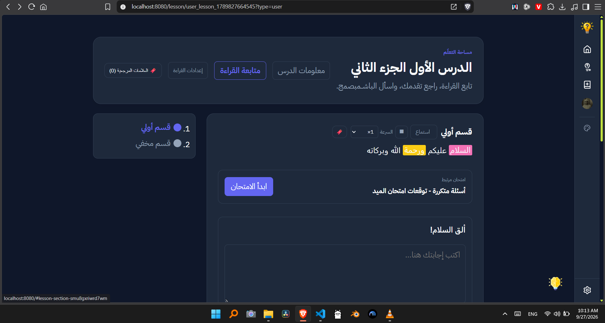
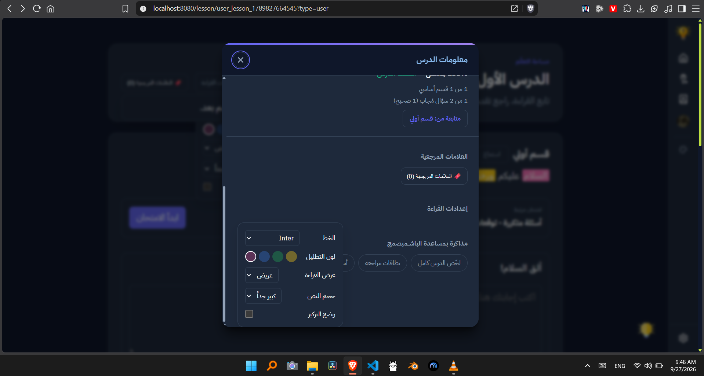
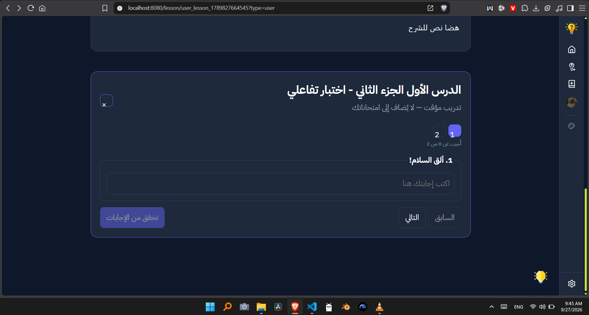
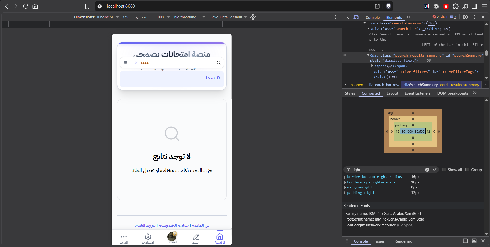

# Project Issues and Follow-up Work

## What is this file
`docs/issues.md` is were I draft my notes/ideas on updated that I'm currently doing, or things I found while testing the pages. These are mostly either fixes or new features ideas. These are drafts that changes constantly, not actual plans that are ready to be implemented. 

Issues in here have to be studies and tested well, then turned into a plan, before actually implementing it.

## Patches

### Lesson Page
Issues:
* `لون التظليل` isn't doing anything at all, if it's useless, remove it.
* `وضع التركيز` isn't synced between the 2 `lesson-prefs__panel`, the one in the main lesson page, and the other inside the info modal.
* `.lesson-section` isn't centered in the page. See .
* The read-aloud feature for the lesson is broken; it doesn't do anything.
* Messed up layout at the bottom of `.quiz-info-dialog-inner`, the `.lesson-prefs__panel` doesn't blend in. See .
* Each question in the lesson has `lesson-question__reset`. Remove it and make one lesson-wide confirmation instead of per question. 
* `.lesson-tts__btn--stop` always appears even when the dictation (read-aloud) feature is off.
* The interactive quiz has many UI issues. See .
* When the `.lesson-prefs__panel` is open, clicking out of it doesn't close it. And opening the `.lesson-bookmarks__panel` also doesn't close it.
* The `.lesson-selection-popup` buttons don't work.
* Improve `.lesson-toc`, make it like the other perfect toc I made before for the document pages, see `public\src\features\documents\doc-toc.js`, make the `.lesson-toc` just like it.

Console log when testing:
```console
script.js:1  Failed to load resource: the server responded with a status of 404 (Not Found)
esdfdzhtavraczrhxnmp.supabase.co/rest/v1/quizzes?select=data&id=in.%28AHMTTSRO%29:1  Failed to load resource: the server responded with a status of 400 ()
lesson-view.js:128 [lesson-view] quizRef lookup failed: invalid input syntax for type uuid: "AHMTTSRO"
fetchQuizRefs @ lesson-view.js:128
user_lesson_1789827664545?type=user:1  Failed to load resource: the server responded with a status of 503 (Service Unavailable)
service-worker.js:161 [SW] Service worker script loaded (offline-page only)
```

* Tested on localhost (localhost:8080).
* A lesson created in the "امتحاناتك" section, not an uploaded lesson.
* URL: `http://localhost:8080/lesson/user_lesson_1789827664545?type=user`

New:
- Design and implement an advanced loading skeleton and remove the stupid `جاري تحميل الدرس…` loading placeholder.

### AI Agent
Fix Dictation: The dictation feature is so messed up, it doesn't work on Brave browser, even though other websites I built worked fine on Brave Browser.

### Create-lesson Page
- Changing the value of `#lessonFontSelect` doesn't change anything.
- `.entry-item` is too tall, improve it's design. And I also want to improve the design of the whole `.entry-screen`, generate an ipmlementation plan suggesting any improvements. 

New: 
- Add password field and description field just like `create-quiz` does, and update the lesson page accordingly.

### Performance (Globally, but specially the main page)
Performance Improvements: Currently, there are many custom mechanism fucntionalities built in JS that works perfectly, but it may exist natively in HTML, CSS, or as a browser API. In that case we shouldn't reinvent the wheel, specially if it exists natively. Anything that exists natively in HTML, CSS, or as a browser API should be used that way and we should delete any custom JS implementation that has native alternatives. That would improve performance very well. Search for everything, anything that can be implemented in HTML & CSS directly without JS should be done so. You can search the web for modern HTML & CSS, because sometimes they add new things, but watch out for compatibility with different browsers (minimum requirenment: Chrome). But I don't want to miss up any functionality, this is just for performance, not to change any fucntionality.

Example: I lately found out that the `/quiz` page was rendering questions through the JS once, then when the user submits their answer, the JS renders the question again to add the explanation & formal answer, I removed it and depended fully on CSS & HTML, the whole question including explanation & formal answer is inserted at the first render, then I make things visible when the user submits the answer using CSS classes. That approach to get away from JS improved performance alot.  

## New Features

### Result Pages

#### Videos (Easy to make, but very important)
- Add a result-page feature that displays themed meme videos based on the user’s degree or score.
- Suggested themes include:
  - دعوية
  - إسلامية
  - قرآن
  - ميمز تشجيع سلبية
  - ميمز تشجيع إيجابية
- Some vidoes will be displayed based on the percentage of the result.

#### Score Guage
- The result page displays the score increase, but doesn't display the updated score. Bring the `#identityLevel` from the profile page to the result page.

### `public/src/shared/markdown.js`
- Resize Handle Issues:
  - Images don't get the resize handles, and they appear aligned to the left or right instead of the middle. .
  *Tested on localhost*

- See `docs\plans\md-engine-prompt.md` and execute its remaining parts.
- Then implement [live render plan](plans/live-render-md-prompt.md)

### Home Page

#### Info Modals
- Quizzes, Lessons, Folders, and Courses store so much info (Check their tables in [DB Context](Database-Schema-Context.md)):
  - Extend the info in the info modal `quiz-info-dialog` (don't show the password ofcourse, but you can show an indication like (privacy: has password) or a similar label)
  - Extend the info in the course info modal, too.
  - Make an info modal for Folders.
  - (Suggestion) Add: Number of Views or people who solved a quiz on each quiz.

### `public\control.html` Page
- Give `#collegeForm` an advanced loading skeleton/animation like the sections/forms.

### `public\about.html` Page
- Suggestion: Add an open-source Angle.
- Suggestion: Add a short testimonial or review.
`المنصة بالأرقام` should have the number of views (maybe try to integraet vercel insights or even something custom).

### Create Quiz Page
`create-quiz.js` is 5000+ lines in one file — This is a good candidate to split into modules.

### Connect Canva
Think of a new way to download quizzes and lessons, maybe through canva.

### Download as Python
Think about this suggestion, a new way to download quizzes.

### Translation and content expansion (Suggestion)
- Add English translation support.

### Offline Page
Improve
- It's colors Should match the theme of the platform (see themes.css and theme-controller.js), but it shouldn't import these files, it should be independent. It should also default to the default theme of the platform.

### `api\og.js`
- Special courses that get the (مادة مميزة) badge, since there is no info table displayed, the middle of the image becomes emtpy, I need to fill it with something, or ideas to improve it when it has the  (مادة مميزة) badge. 