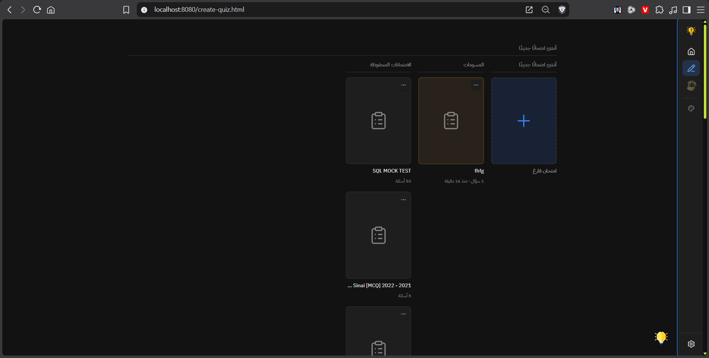

# Fix AI Agent Issues

## Original Issues Draft
### AI Agnet Issues

#### Issue with a specific conversation I took with it
- 
- 


Tested on localhost:
```
hook.js:1  POST http://localhost:8080/api/ai-agent/chat 502 (Bad Gateway)
apply @ hook.js:1
resendLastUserTurn @ ai-agent-chat.js:2231
resendLastUserTurn @ ai-agent-chat.js:2395
await in resendLastUserTurn
sendMessage @ ai-agent-chat.js:2455
(anonymous) @ ai-agent-chat.js:2472
ai-agent-chat.js:2257 [ai-agent-chat] /api/ai-agent/chat responded 502: {error: 'فشل الاتصال بمزوّد الذكاء الاصطناعي', detail: 'fetch failed'}detail: "fetch failed"error: "فشل الاتصال بمزوّد الذكاء الاصطناعي"[[Prototype]]: Object
resendLastUserTurn @ ai-agent-chat.js:2257
await in resendLastUserTurn
resendLastUserTurn @ ai-agent-chat.js:2395
await in resendLastUserTurn
sendMessage @ ai-agent-chat.js:2455
(anonymous) @ ai-agent-chat.js:2472
```

#### User Prompt
Makrdown rendering gets applied on the AI Agent Answer but not the user prompt. 

#### Creating Quizzes
- The AI Agent doesn't have the ability to set the place where the quiz gets put, it always get put inside `/#my-quizzes` directly. It should be able to set it's initial place (e.g., `/#my-quizzes/math/` or `/#my-quizzes/math/algebra/`).

#### Create-Quiz Page
Some of the elements of the AI Agent are broken on the create-quiz.html page, like the `.ai-agent-more-btn` and the `.ai-agent-history-item-more`

#### Result Page
The `.ai-agent-history-item-more` doesn't work on the result.html page.

#### Settings
Labels aren't connected to their inputs "No label associated with a form field"

#### Improvements
- The AI Agent Chat should use icons instead of emojis for pinned items. So when an item is pinned, the `.ai-agent-history-item-more` icon displays a pinned icon, instead of a more icon, to indicate that this item is pinned in a premium way.
- Remove the `لغة ردود المساعد` option from the settings, leave the choice of language to the AI, or the user can tell it in the prompt itself, remove that setting totally.
- Improve the UI/UX of the `.ai-agent-settings-actions` in the settings panel under the `مفتاح API الخاص بك (اختياري)`, so that both buttons are invisible when there is nothing saved (since there would be nothing to save or delete, the 2 buttons are useless), when the user is typing and nothing is saved, the save button only appears, when the value is saved the delete button only appears.
- The AI Agent has the side-menu on the left on desktops, but it pops from the right on phones, phones should have it pop from the left just like desktops.
- The side-menu on phones is too wide, it takes most of the AI Agent window.
- The Carrot in the `.ai-agent-chat-model-select` is too close to the left border, fix the padding or the margin or whatever is broken.

## Fixed & confirmed (After Partial Implmentation)

**1. 502 Bad Gateway** — Diagnosed: `"fetch failed"` with no `upstreamStatus` means Node's `fetch()` never got an HTTP response at all (DNS failure / connection refused / no outbound network path from that localhost box to the provider host). This isn't a code bug — I added `isNetworkLevelFailure()` detection in `api/ai-agent/chat.js` so this case now returns a clear, actionable Arabic error message instead of the generic one, and logs the actual cause code (`ENOTFOUND`/`ECONNREFUSED`/etc.) server-side for diagnosis.

**2. Markdown not rendered on user prompt** — Found in `ai-agent-chat.js`'s `appendMessage()`: user messages used `textContent` + manual line-splitting instead of `renderMarkdown()`. Fixed by routing both roles through the same `renderMarkdown()` call (it already handles the per-line RTL/LTR logic internally, so nothing was lost).

**3. Quiz creation location** — Added a `folder` parameter to `CREATE_QUIZ_TOOL`'s schema (mirroring the existing `create_folder`/`move_item` pattern), and wired `handleCreateQuizToolCall` in `user-quizzes-view.js` to resolve it via the existing `resolveFolderTitleToId()` helper and pass it as `parentId` to `saveNewUserQuiz` (which already supported this param).

**4/5. Broken `.ai-agent-more-btn` / `.ai-agent-history-item-more` on create-quiz.html and result.html** — Root cause found: these buttons open a `.exam-dropdown-menu` popover, but its CSS (`.exam-dropdown-menu`, `.exam-action-btn`) only lived in `home/index.css`, which create-quiz.html and result.html never load. The JS worked fine — the menu was just unstyled/invisible. Extracted the shared rules into a new `exam-dropdown-menu.css` and linked it on both pages.

**6. Settings labels not associated with inputs** — Confirmed in `ai-agent-settings.js`: every `<label>` was created without `for`. Added unique per-instance `id`/`for` pairs for the provider select, model select, API key input, and system-prompt label/textarea (`${instanceId}-provider`, `-model`, `-key`, `-system-prompt`, suffixed by `settingsPanelInstanceCounter` so multiple panel instances never collide).

**9 (language setting removal).** Removed the "لغة ردود المساعد" label/select block entirely from the settings panel, and cleaned up all the now-dead machinery: `LANGUAGE_STORAGE_PREFIX`, `LANGUAGES`, `LANGUAGE_DIRECTIVES`, and `getResponseLanguage`/`setResponseLanguage`/`applyResponseLanguage` are all deleted from `ai-agent-settings.js` (confirmed nothing outside this file referenced them), and the `applyResponseLanguage` import + call in `ai-agent-chat.js` were replaced with a direct `getSystemPrompt(...)`. Response language is now fully left to the model (inferable from the conversation or an explicit ask in the prompt).

**API key save/delete button visibility (auto).** `.ai-agent-settings-actions` under "مفتاح API الخاص بك (اختياري)" is now state-driven via `updateKeyActionsVisibility()` in `ai-agent-settings.js`:
  - Nothing saved + nothing typed → both buttons hidden (nothing to save or delete).
  - Nothing saved + user typing → Save appears alone.
  - Saved value in the field untouched → Clear appears alone.
  - Saved value edited → both appear (Save persists the change, Clear deletes the stored key).
  Added `.ai-agent-btn[hidden] { display: none }` so the `[hidden]` attribute takes effect against the buttons' `display: inline-flex` (same fix `.ai-agent-send-btn[hidden]` already uses).

## Not yet done
- None — all identified items are fixed; see "Done in this continuation" below.

## Done in this continuation
- Finish #6 (system-prompt label `for` / textarea `id`)
- #9 API key save/delete button visibility logic (see above)
- Clean up all dead language-setting code (see above)
- #10/#11: mobile side-menu now slides from the LEFT (matching desktop) and is narrower — `min(76vw, 300px)` instead of `min(86vw, 320px)`, anchored `left: 0` with `transform: translateX(-100%)`
- #12: `.ai-agent-chat-model-select` caret no longer hugs the left border — padding is now `6px 10px 6px 30px` (the field is `direction: rtl`, so the caret side is the left)
- Pinned history items: the `.ai-agent-history-item-more` button now shows a filled-pin SVG icon (tinted `--color-primary`, via new `PINNED_ICON_SVG` + `.ai-agent-history-item-more--pinned`) instead of the ⋮ icon, and the old 📌 emoji badge was removed (pinned titles get a primary-color tint; pinned aria-label says "خيارات المحادثة (مثبتة)")