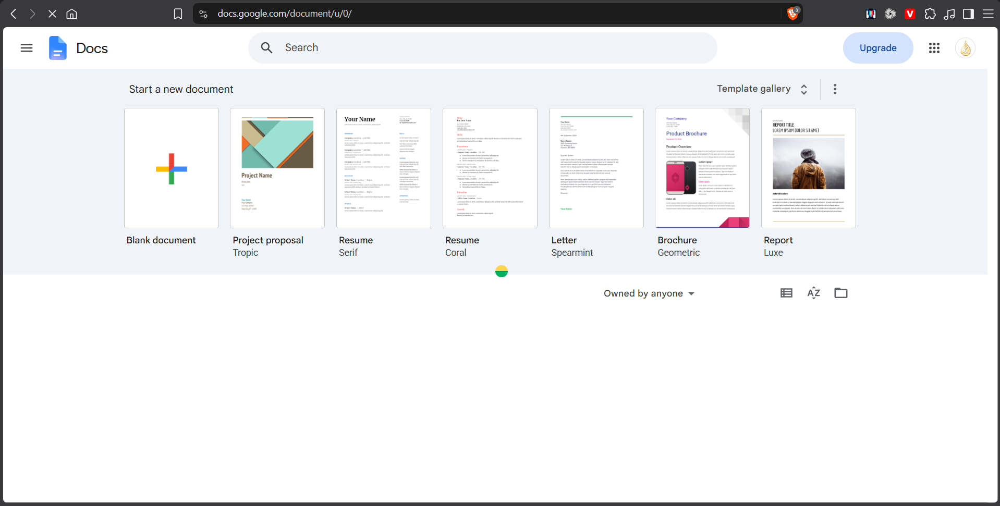

## Context

You are working on a quiz creator page for an Arabic educational platform called بصمجي. The three key files are:
- `d:\Code projects\Websites\منصة إمتحانات بصمجي\public\create-quiz.html`
- `d:\Code projects\Websites\منصة إمتحانات بصمجي\public\src\features\create\create-quiz.js`
- `d:\Code projects\Websites\منصة إمتحانات بصمجي\public\src\features\create\create-quiz.css`

The page is RTL (Arabic). It uses IBM Plex Sans Arabic. A fixed sidebar sits on the right edge using CSS variable `--sidebar-collapsed-width` (64px). Fixed bars must use `right: var(--sidebar-collapsed-width)` and `left: 0` to span the full width. There is NO browser preview available — inspect code directly. The project runs on `npm run dev`.

The page currently has TWO fixed bars at the top:
1. `#appTitleBar` (44px) — home button + quiz title (click-to-rename span `#appTitleText`) + autosave indicator
2. `#menuBar` (44px) — a Google-Docs-style menu (الملف, تعديل, عرض, إدراج) + `.menu-bar-quick-actions` on the left (duplicate save/preview buttons)

Each question card has a `.wp-editor` containing a `.wp-bar` (markdown toolbar) and `.wp-tab` switchers ("كتابة" / "المعاينة"). The function `mdEditorHtml(id, ...)` in the JS generates this HTML.

---

## Tasks to implement

### 1. Fix the `.menu-item-submenu` hover UX (CRITICAL)

The submenu inside the "الملف" dropdown ("سؤال من القوالب") is completely unusable: when the user hovers the submenu trigger, the parent dropdown closes before they can reach the submenu.

**Root cause:** The parent `.menu-dropdown` has a `mouseleave` close listener that fires before the submenu CSS `:hover` engages.

**Fix required:**
- The parent `.menu-dropdown` must stay visible while any mouse pointer is inside it OR inside its child `.menu-submenu-dropdown`
- Use CSS-only or minimal JS: add `pointer-events: none` discipline, or attach the close listener to the outer `.menu-item` wrapper instead of the dropdown itself, so hovering inside any child element doesn't close the parent
- The submenu (`.menu-submenu-dropdown`) should appear on `:hover` of `.menu-item-submenu` and disappear when neither the trigger row nor the submenu is hovered
- Search for all JS related to menu open/close (`openMenu`, `toggleMenu`, document click listener, etc.) and make sure they don't close the dropdown on internal mouse events

### 2. Merge `#appTitleBar` + `#menuBar` into one unified fixed bar

Replace the two 44px bars with a single 48px bar (`#topBar` or keep id `#appTitleBar`):
- **Right side** (RTL start): home icon button → quiz title span (`#appTitleText`, click-to-rename)
- **Center/left side**: the menu items (الملف, تعديل, عرض, إدراج) from `.menu-bar-inner`
- **Far left**: autosave indicator only
- **Remove** `.menu-bar-quick-actions` entirely (the duplicate icon buttons for save/preview/reset)
- The merged bar must keep `position: fixed; top: 0; left: 0; right: var(--sidebar-collapsed-width)` and remain 48px tall
- Update `body.quiz-form-active .container { margin-top: ... }` to match the new single-bar height
- Update all JS that references both `#appTitleBar` and `#menuBar` (show/hide in `showQuizForm()`, `showEntryScreen()`, etc.) to reference the single merged bar
- Keep all existing menu dropdown logic intact

### 3. Remove per-card `.wp-bar` and add a single global Markdown+LaTeX toolbar

#### 3a. Remove `.wp-bar` from all question cards
In `mdEditorHtml(id, placeholder, value, rows)` in `create-quiz.js`, remove the `${mdToolbarHtml(id)}` call and the `.wp-tab` tab switcher buttons ("كتابة" / "المعاينة"). The textarea should be directly accessible without switching tabs. Keep the `.wp-pane-wrap`, `.md-source` textarea, and `.wp-preview-pane` elements.

Also remove `mdToolbarHtml()` function (or keep it unused) and `.wp-bar` CSS rules — they will no longer appear in cards.

#### 3b. Add a global fixed toolbar `#globalMdBar`

Add a new fixed bar `#globalMdBar` that sits directly below the merged top bar (i.e., `top: 48px`). It must:
- Span the full width: `left: 0; right: var(--sidebar-collapsed-width)`
- Be `40px` tall, `position: fixed`, `z-index: 49`
- Have a subtle border-bottom and a semi-transparent background matching `--color-surface`
- Only be visible when `body.quiz-form-active` (same as the top bar)

The toolbar must contain two groups of buttons in a scrollable horizontal row:

**Group 1 — Markdown formatting:**
| Button | Action | Icon hint |
|---|---|---|
| **B** | Wrap selection with `**...**` | Bold |
| *I* | Wrap with `*...*` | Italic |
| ~~S~~ | Wrap with `~~...~~` | Strikethrough |
| `</>` | Wrap with `` `...` `` | Inline code |
| ``` ``` | Insert ` ```\n\n``` ` block | Code block |
| `"` | Wrap with `> ` | Blockquote |
| `—` | Insert `---` | Horizontal rule |
| `• List` | Insert `- item` | Unordered list |
| `1. List` | Insert `1. item` | Ordered list |

**Group 2 — LaTeX math (insert at cursor in active field):**
| Button label | Inserted LaTeX |
|---|---|
| `x²` | `^{}` (superscript) |
| `xₙ` | `_{}` (subscript) |
| `a/b` | `\frac{}{}` |
| `√` | `\sqrt{}` |
| `Σ` | `\sum_{}^{}` |
| `∫` | `\int_{}^{}` |
| `∞` | `\infty` |
| `π` | `\pi` |
| `±` | `\pm` |
| `≤` | `\leq` |
| `≥` | `\geq` |
| `≠` | `\neq` |
| `→` | `\rightarrow` |
| `matrix` | `\begin{pmatrix} & \\ & \end{pmatrix}` |
| `$…$` | Wrap selection in `$...$` |
| `$$…$$` | Wrap selection in `$$...$$` |

**Toolbar behavior:**
- Clicking any button applies the action to the **currently focused** `.md-source` textarea (track `document.activeElement` or last-focused `.md-source` on `focus` event)
- If no field is focused, show a brief tooltip "انقر على حقل نصي أولاً" and do nothing
- For wrap actions: if text is selected → wrap selection; if cursor only → insert template and place cursor inside braces
- After inserting, re-focus the textarea and trigger an `input` event so autosave fires

#### 3c. Update `.container` margins

Since there are now 2 fixed bars (merged top bar 48px + global md bar 40px = 88px total), update:
```css
body.quiz-form-active .container {
  margin-top: 98px; /* 88px bars + 10px breathing room */
}
```

## Critical Issue

The start screen is listing the 3 different sections next to each other instead of under each other, so the elements of each section are currently under each other
- Current Behavior: Sections next to each other 
- Expected Behavior: Sections under each other like Google Docs 


## Critical Issue 2

I still can't hover or use submenus like: `سؤال من القوالب`